# EDGSP（**能量双引导单点提示**）

**论文标题：Beyond Full Labels: Energy-Double-Guided Single-Point Prompt for Infrared Small Target Label Generation**

**论文链接：arXiv:2408.08191v5 \[cs.CV] 16 Nov 2024**

# 摘要

这篇论文于2024年发表，在这里，单点监督已经在红外小目标检测上得到了相当可观的应用，在精标注下，Pd更是达到了100%。该论文相对于前两篇已经不再依赖模型学习中间结果或采样分布，而是从图像物理属性直接挖掘目标区信息，首次提出了一种基于单点提示的红外小目标伪标签生成框架（EDGSP），实现了多个数据集上高精度的伪标签生成，显著降低了标注成本。

# **IRSTLG （红外小目标标签生成）的目标**

> **IRSTLG 的目标：**   取代像素级手动标注

**这些自动生成的伪标签是否比检测模型推断出的掩码更准确？**

作者通过对比5种红外小目标检测模型和3种标签生成算法。发现伪标签往往比检测模型生成的掩码质量更差。如下图所示。

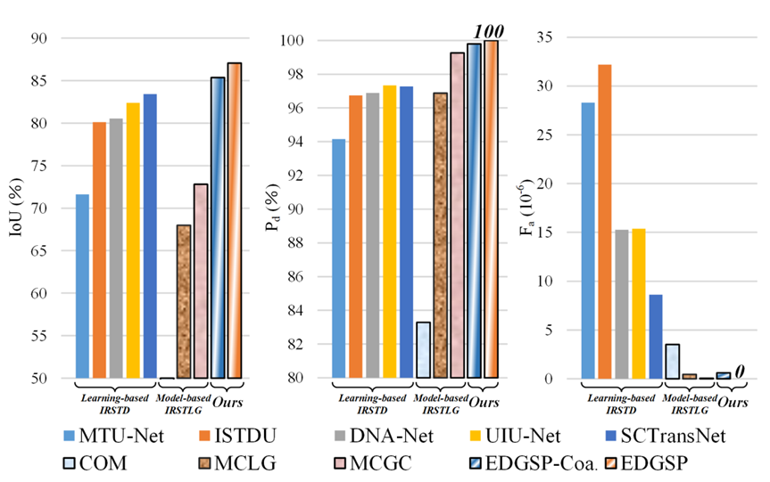

从上图IOU，Pd，Fa三项指标可以看出，这些方法即使知道目标位置，标签生成方法仍然会遗漏目标或者误标，值得注意的是，EDGSP方法的IOU最高，Pd和Fa值达到了惊人的100%和0%，那么**EDGSP是如何克服这些问题而到达这么高的精确度呢？**

# 模块组成

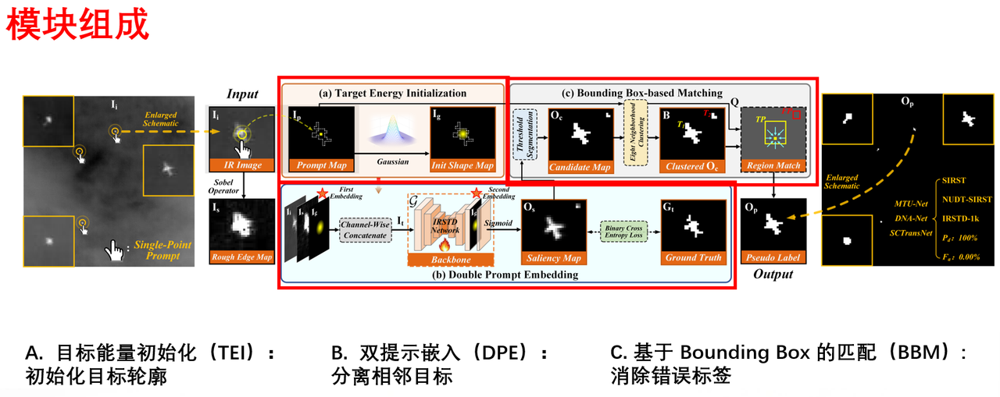

## **A. 目标能量初始化（TEI）**

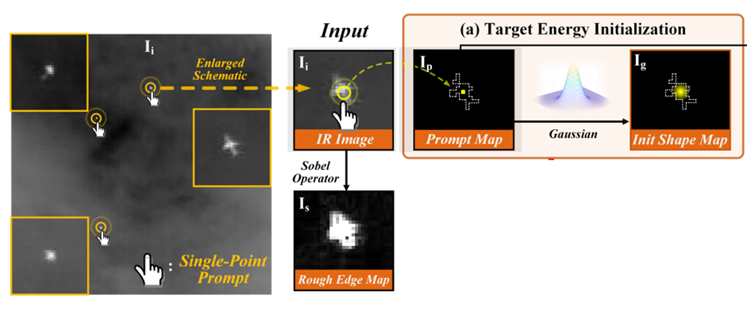

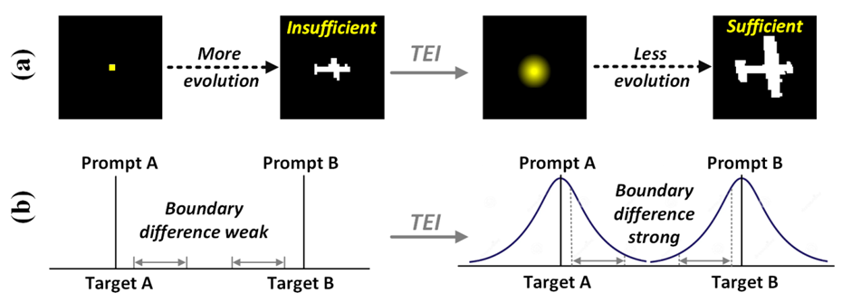

这是TEI的操作部分，首先输入一张红外图像，图中框出了一个手动点击的单点提示并通过 Sobel 算子提取粗边缘信息，那么简单来说就是输入图像和单点提示构成了后续处理的起点，之后整个过程从下列公式来看，设单点提示（x0，y0），则只有在提示点位置的时候值为 1，其它为 0，构造提示映射Ip。小目标的像素特征我们可以把它描述为一个类高斯分布，中间很亮，边缘像素值对称式逐渐衰减，就如b图的那个类高斯曲线，能很好的表达“小而明确”的目标区域。**（这个好处是，类似于人类视觉上的对焦，人的注意力就是从中间逐渐扩散，能很好地模拟视觉“聚焦”的过程。）**

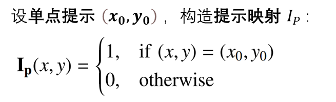

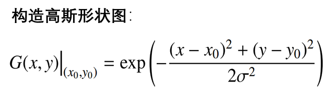

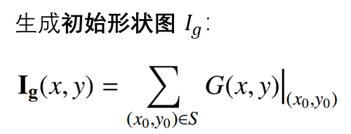

作者基于小目标这个类高斯特性，将提示点扩展成高斯图，如第二个公式所示，模拟能量从提示点向外扩散的过程。最后多个高斯叠加生成初始形状图Ig。右图展示了经过TEI能量初始化之后的效果，通过 TEI，目标区域更加清晰完整、能量集中，分类边界也明显增强。

## **B. 双提示嵌入（DPE）**

我们知道，人类识别物体，不仅需要知道在哪里，还需要知道边界在哪里，作者在这里使用双提示嵌入DPE来得到这些信息，让模型更准确地预测红外小目标的区域。

**如果考虑使用SAM来得到这些信息是否可行？**

这确实是一个很好的思路，传统的单点提示分割方法如SAM在目标检测中使用 Transformer 提取提示信息，但红外小目标的空间区域很小，就容易导致提示区域和目标区域重叠度太高，目标信息容易丢失等问题，分割的效果不是很好。

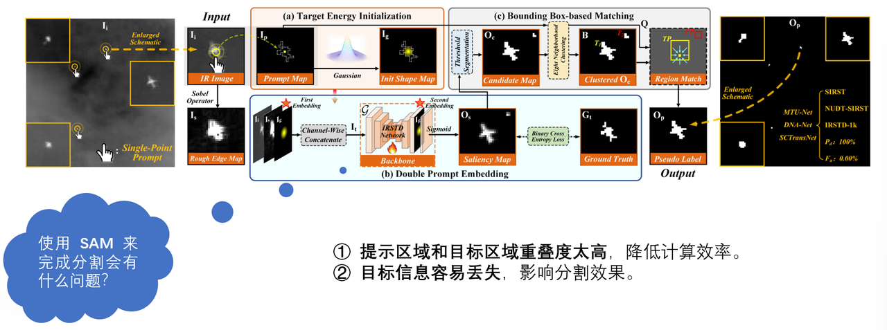

双提示嵌入包括点提示和边缘提示，  DPE采用通道级级联嵌入法，将提示信息两次嵌入到这个网络中，以增强目标区域的识别能力。

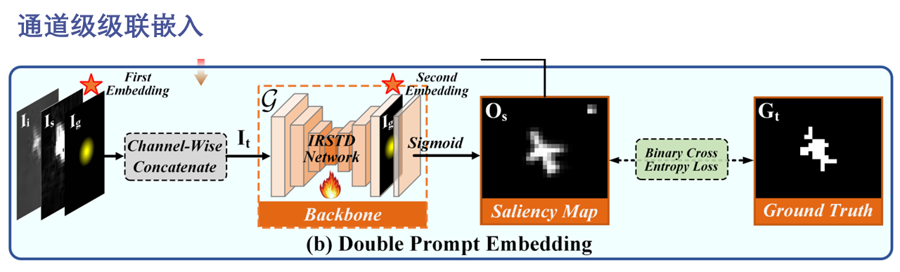

具体实现如下，首先计算红外图像的边缘信息，使用concat函数组合输入图像，边缘图和初始形状图，  第一次嵌入，用于定位目标的大致区域，  第二次嵌入，再次使用初始形状图Ig作为语义映射，嵌入网络，用于强调目标数量和边界信息，防止近距离目标粘连。

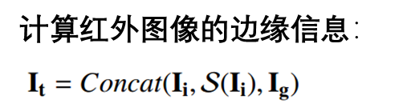

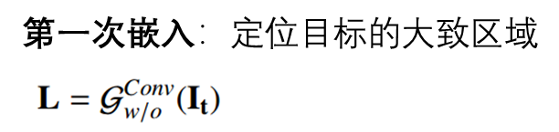

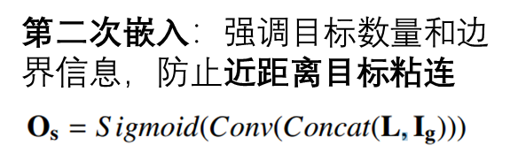

## **C. 基于 Bounding Box 的匹配（BBM）**

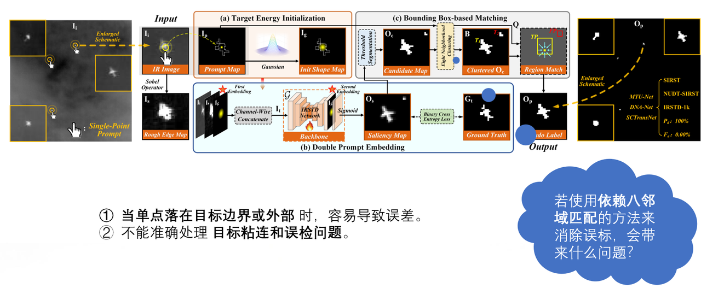

在剔除误标这一方面，作者采用基于Bounding Box的匹配的方法，**基于我们在LESPS第一篇论文中提到的用8-连通区域来消除虚警，为什么在这里不使用呢？或者说如果使用会带来什么问题呢？**

> 问题有两条，第一点，当单点落在目标边界或外部时，非常容易导致误差，  第二它不能准确处理目标粘连和误检问题，也就是说如果目标连在一起时他会认为这是一个东西。 &#x20;

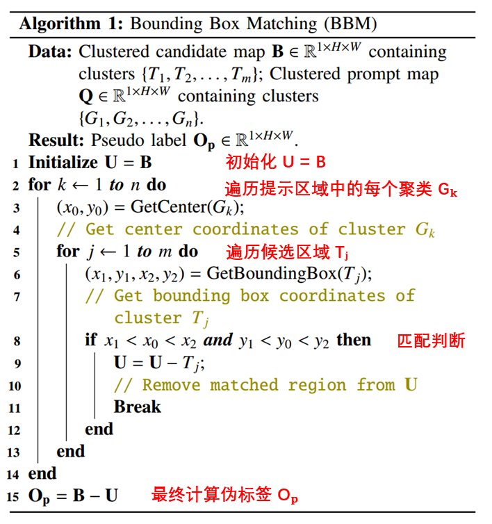

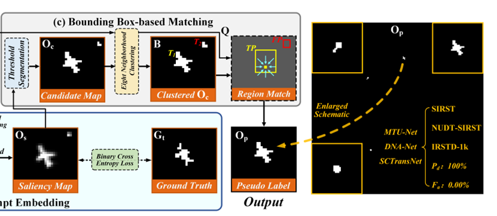

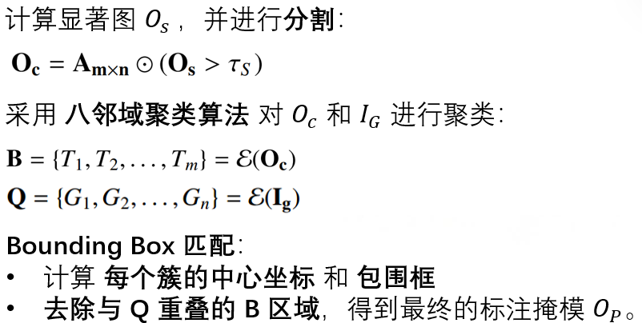

首先是计算显著图并进行分割，tao s是分割阈值，然后采用八邻域聚类算法对Oc和Ig进行聚类得到B和Q，B是显著图聚类后的候选目标区域，Q是初始形状图聚类后的目标区域，最后进行Bounding Box 匹配，计算每个簇的中心坐标和包围框并去除与Q重叠的B区域，得到最终的标注掩膜。

左图是介绍整个BBM算法的代码，  首先是初始化 U = B，变量 U 代表当前未匹配的候选区域，初始化为 B，之后遍历提示区域中的每个聚类 Gₖ，取 Gₖ 的中心坐标 (x₀, y₀)，找到 Gₖ 是否位于某个候选区域 Tⱼ 的边界框内，然后遍历候选区域 Tⱼ，获取 Tⱼ 的边界框坐标 (x₁, y₁, x₂, y₂)，找到 Gₖ 所在的候选区域，进行匹配判断，如果 (x₀, y₀) 落在 (x₁, y₁, x₂, y₂) 形成的矩形范围内，从 U 中移除 Tⱼ，直接跳出当前循环，最终计算伪标签 Oₚ， 最后B – U计算出Op，也就是保留未被匹配的区域。

# 实验结果

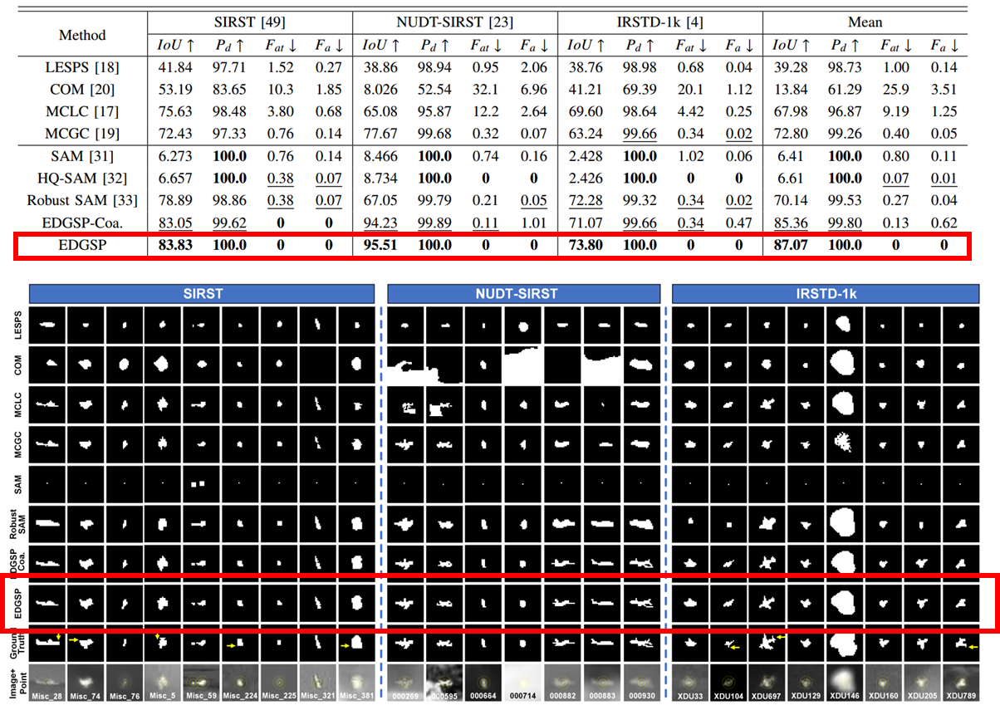

**EDGSP很多细节都基于人类的视觉思维考虑，不管是类高斯分布，还是双提示嵌入，恰恰能使模型训练到非常完美的精度。**

实验结果表明，IOU接近90点，Pd达到100%，Fa达到0%，数据非常突出，比以往的方法都要好的太多。总结来说，LESPS，MCLC，EDGSP三种方法均基于单点监督，以极低成本来提升红外小目标检测性能。各方法主要从标签进化、区域聚类、伪标签生成等不同角度创新，来用于不同任务需求。

