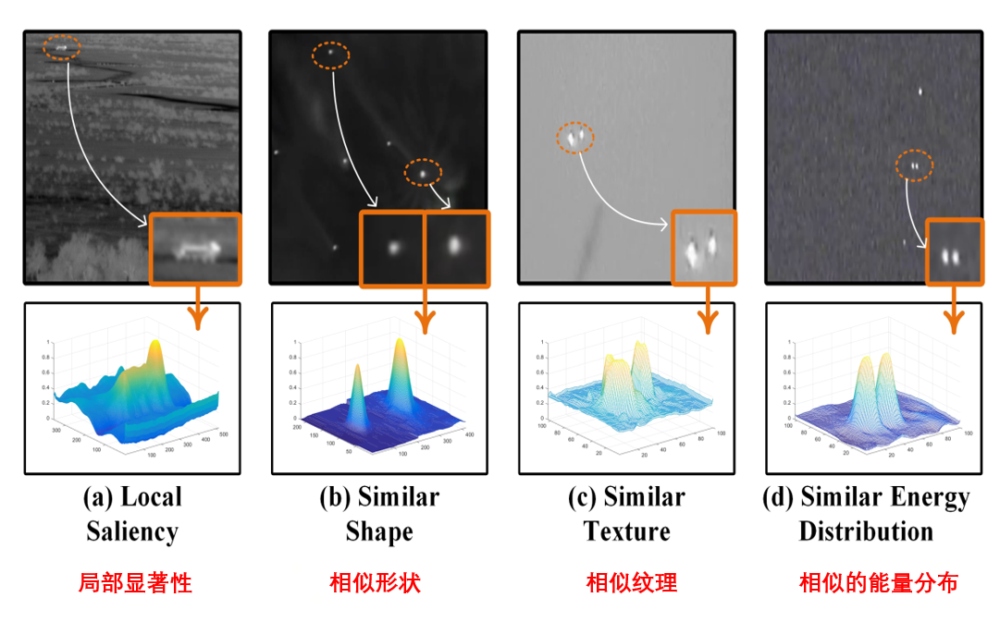

# Introduction
# 什么是单点监督？

单点监督属于弱监督的一种，是指仅使用目标的一个点作为监督信息来训练模型。

# 单点监督在目标检测上的应用

**图源：Point-to-Box Network for Accurate Object Detection via Single Point Supervision**

**WSOD+OTSP：**

> **Hodgepodge in bag!（类别混杂的问题）**

**PSOD+OTSP：**

> **基于单点标注的目标检测（PSOD）**

**PSOD+P2BNet+Detector：**

> **摒弃 OTSP，改进候选框生成**

# 红外小目标检测的特殊性

**局部显著性**

&#x20;     通过左边上方的红外图像和他的3D曲线图可以看到目标区域形成了一个突出的峰值，说明红外小目标它通常在局部范围内表现出明显的亮度对比，与周围背景有较大的差异。

**形状与纹理相似**

&#x20;     形状与纹理相似，从中间两幅图可以看到，在红外图像中，许多小目标具有相似的形状，大多呈现点状或椭圆形，而且这些小目标和某些背景区域具有相似的纹理特征。形状上的相似，容易导致检测时出现混淆，而纹理上的相似，使得分割任务变得非常困难。

**相似的能量分布**

&#x20;     右侧的图像展示了多个目标在能量分布上的相似性，许多红外小目标在频域或者能量分布上表现出类似的模式，很可能导致误检，这就需要利用其他信息进行区分。

# **各监督方式的标注方法和成本**

&#x20;     近年来，以完全监督的方式训练卷积神经网络来检测红外小目标引起了显著的研究关注，但这种方法的人工成本非常高昂。

**d.单点注释  e.多点注释   f.涂鸦   g.边界框   h.像素级注释（完全监督）**

*单点标注耗时最少，成本最低，与像素级标注方法相比，单点监督可以减少约87%的标注时间！！！*

&#x20;     虽然基于完全监督的像素级标注耗时最多，但却能完成高质量的学习。这就为小目标研究工作提供了一个很好的思路，如果使用单点监督进行检测，性能上做到还能堪比全监督方法的话，既能做到节约成本，又能做到精确检测，那么，绝对可以说是一个很好的SOTA。
