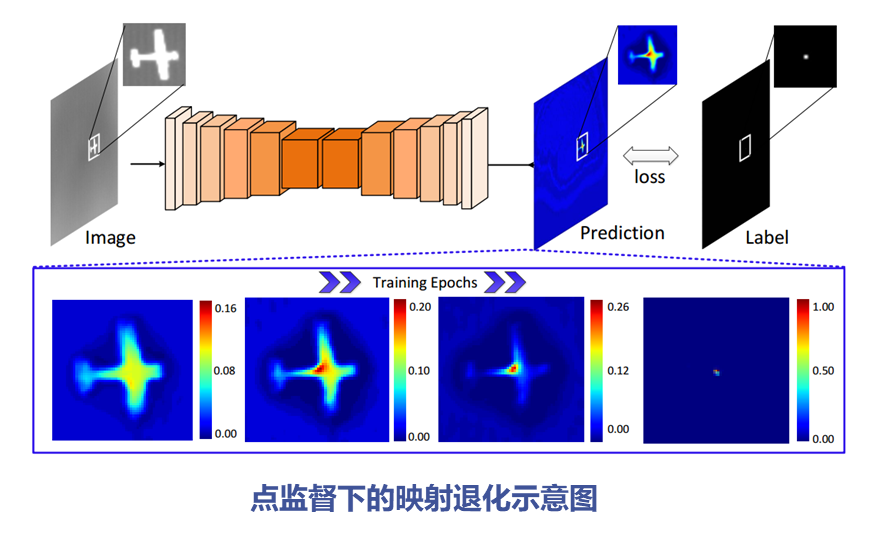
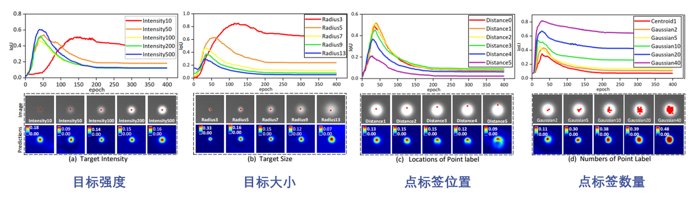
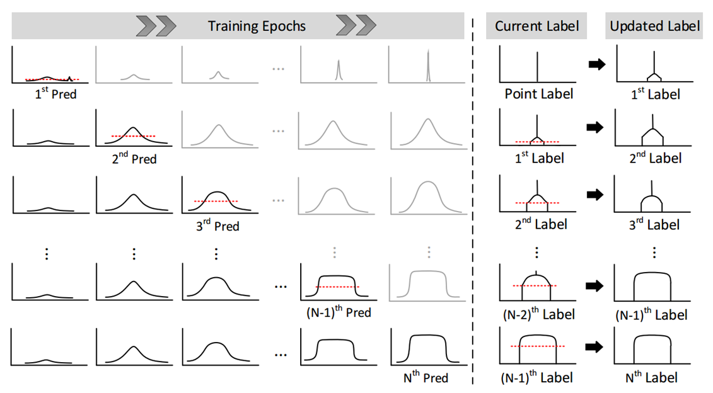
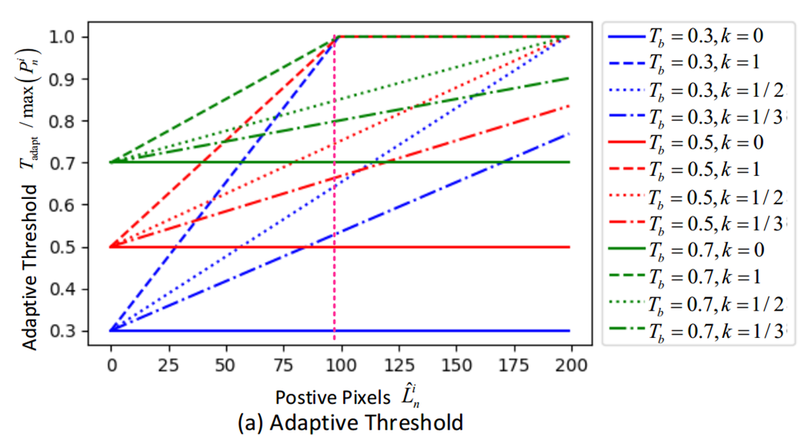
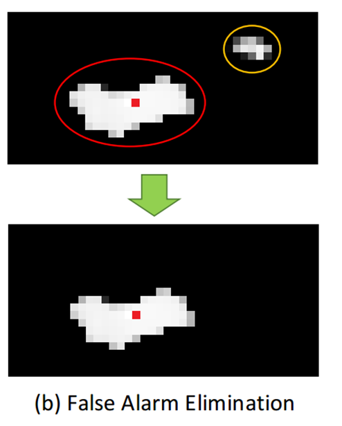
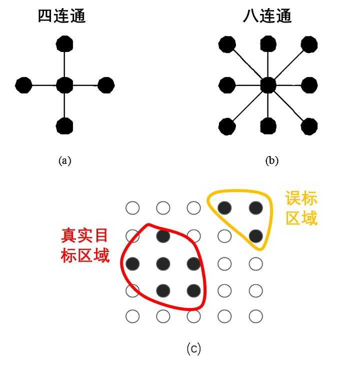
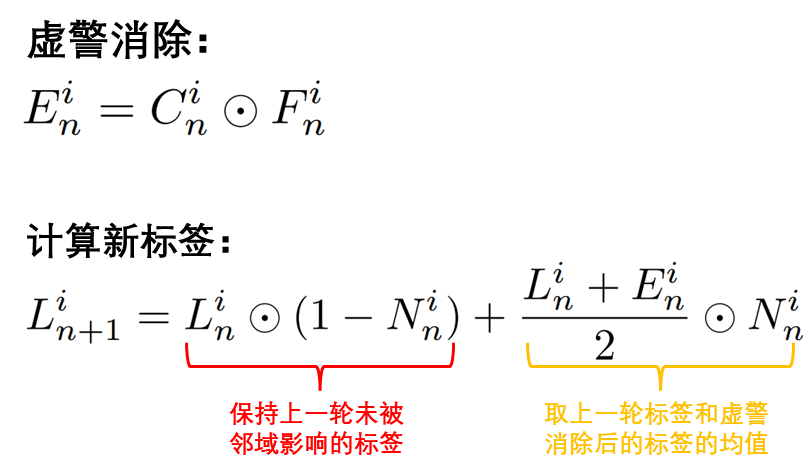
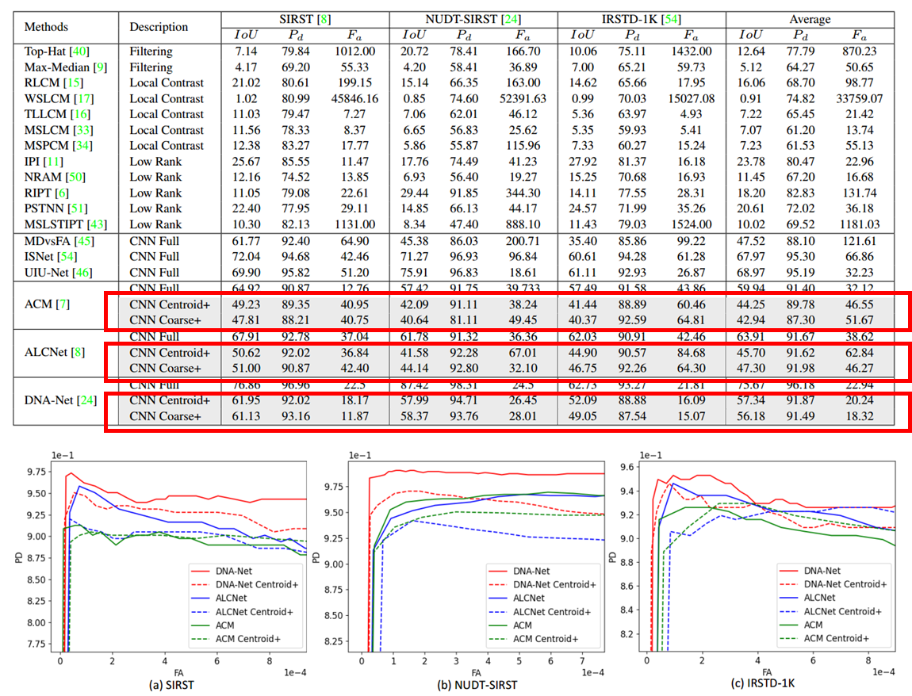

# 文献梳理1：LESPS
# **LESPS（单点监督标签进化）**

**论文标题：Mapping Degeneration Meets Label Evolution: Learning Infrared Small Target Detection with Single Point Supervision**

**论文链接：arXiv:2304.01484v3 \[cs.CV] 4 Oct 2024**

# 摘要

&#x20;     这是国防科大发表在2023年CVPR上的一篇论文，该论文提出了一种名为LESPS的标签演化框架，探讨了在仅有点级监督的情况下，如何通过标签演化的方法，实现对红外小目标的检测。整个流程下来，作者尝试引入单点监督下的层级演进来降低标注成本，其中发现了非常关键的映射退化现象，并巧妙利用此现象来增强红外小目标检测的性能。

# 映射退化

&#x20;     图中上半部分是一个比较简单的网络架构，大致过程就是，左侧灰度图像输入后经过多个卷积层，卷积层的作用就是提取特征并进行预测，后面的蓝色特征图就是预测结果，其中热点区域表示网络关注的位置。再往后就是真实标签，仅提供一个小范围的点标注来作为监督信号，之后的话就是通过将这个预测结果与真实标签进行比较，来计算损失进行反向传播。下半部分完美演示了这个映射退化，很明显，随着训练的进行热图的亮度和范围逐渐缩小，最终趋近于真实目标的中心点，从而表现出监督信号的退化。

**造成映射退化的原因**：

1. **红外成像的特殊性**

2. **红外小目标的高局部对比度**

3. **神经网络的学习特点（CNN训练本身就具有从易到难的学习特性，这个特性的影响下导致最终退化为点标签。）**

# 映射退化分析

**实验结果分析：**

* **目标强度大 → 最大 IoU 高，训练更快**（>100 强度更优）

* **目标越大 → 最大 IoU 低，映射退化更快**（目标增大加剧退化）

* **点标签位置偏离中心 → 最大 IoU 下降**（尤其是偏向边缘）

* **标签点数多 → 最大 IoU 提高**（更多监督抑制退化）

# **LESPS 标签进化过程**

*利用 CNN 的中间预测逐步扩展单点监督的标签，最终形成完整的目标掩码。*

&#x20;     图中左侧是训练部分，这一部分展示了在不同训练epoch下的神经网络的中间预测结果，很明显，最初的前几次预测比较随机，难以识别出目标区域，但是作者通过多轮训练后，网络预测已经接近相当完整的目标。如果不进行 LESPS 多轮更新迭代，就如同这些灰色曲线那样，模型仍然会生成预测结果，但这些结果的质量，就不是很理想了。那么右侧部分另外显示了标签的更新过程，初始状态是只有点标签，也就是目标位置的一个单点，在经过第 1 轮更新后，利用 CNN 的预测值，并通过自适应阈值来扩展扩展点标签，形成第1轮label，图中红色虚线就是之后会提到的这个自适应阈值，作者通过它来进行候选像素的提取，之后的几轮更新会重复刚才的操作，在前一轮标签的基础上继续扩展目标区域，形成这一轮的Label。通过多轮迭代，最终会恢复完整的Mask。通过这个迭代的方式，能够使 CNN 学习像素级目标区域，从而有效避免映射退化，提高检测性能。

## **A. 候选像素提取**

***目标：从 CNN 预测中选出可能属于目标的像素。***

在标签进化方法中，每个epoch的标签更新都基于网络的中间预测值。那么如果误检测的噪声点被错误纳入目标造成累积误差该如何解决？

> 作者使用自适应阈值来控制并提取哪些预测值可以被接受或者说可能属于目标像素，然后用于更新标签去解决这个问题。

&#x20;     横轴表示当前目标区域内已标注像素的数量，随训练epoch增加，目标区域逐步扩大。纵轴的话就是这个自适应阈值，它决定了一个像素是否应该被纳入新的目标区域。它的值越高，说明需要更高置信度的预测值才能被接受，减少误检风险；值较低时，更容易将新的像素纳入目标区域。中间粉色虚线表示一个固定的参考阈值，k表示控制阈值随正像素数量变化的程度，k 越大，阈值增长越快，更能严格地控制标签更新。整个过程主要是通过Tb和 k的调整，来控制阈值的起点及增长速率。作者选择红色虚线所表示的自适应阈值来用于LESPS目标像素提取，确保模型能够稳定进化。**毕竟阈值过低容易误选，阈值过高又过于严格。**

## **B. 虚警消除＆标签更新**

***目标：去除由于噪声或背景干扰导致的误检并将候选像素与原标签融合，生成新的监督信号。***

# 实验结果

> **LESPS** **在标注成本和泛化能力上占优，且误检率较低，但** **IoU 仍然低于全监督方法，特别是在复杂背景下。**

