# 文献梳理2：MCLC
# MCLC（蒙特卡洛线性聚类）

**论文标题：Monte Carlo Linear Clustering with Single-Point Supervision is Enough for Infrared Small Target Detection**

**论文链接：arXiv:2304.04442v1 \[cs.CV] 10 Apr 2023（ICCV 2023）**

# 摘要

&#x20;      这篇是国防科大联合上海交大等高校发表在ICCV上的论文，该论文提出了一种基于蒙特卡洛线性聚类的新方法，仅需单点监督就可以实现高效的红外小目标检测，在简化了标注成本的基础上，进一步提高检测性能。

# 蒙特卡洛算法核心思想

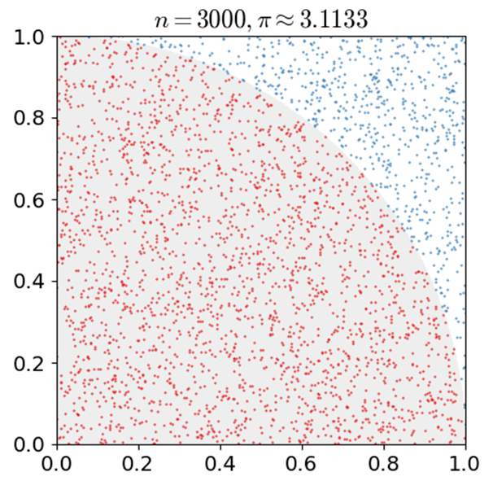

**蒙特卡洛核心思想**

**随机采样：**&#x5728;问题定义的范围内生成大量随机样本。

**模拟计算：**&#x5BF9;每个样本进行模拟或计算。

**统计结果：**&#x901A;过统计结果逼近真实解（如概率，面积，期望值等）。

&#x20;                  蒙特卡洛算法示例图（动图）

在正方形内撒随机点并判断点是否落在四分之一圆内，然后重复实验，统计红点比例，最后会发现，点越多，估算值越逼近于Π这个值。那么知晓这个算法后，作者将蒙特卡洛这个特性巧妙应用在训练模型中，通过概率图筛选出真正稳定、可信的目标区域，来提升鲁捧性。

# 蒙特卡洛线性聚类

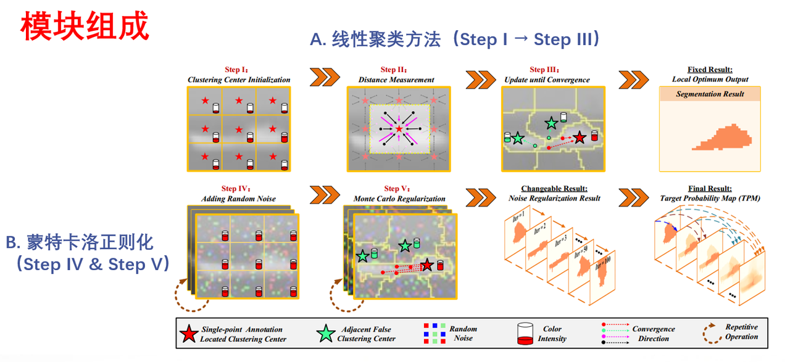

## A. 线性聚类方法

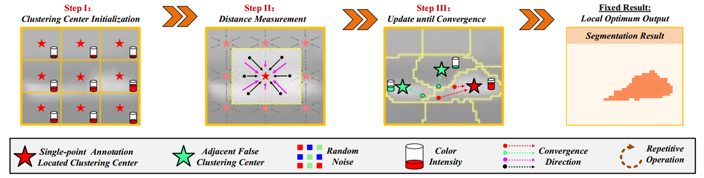

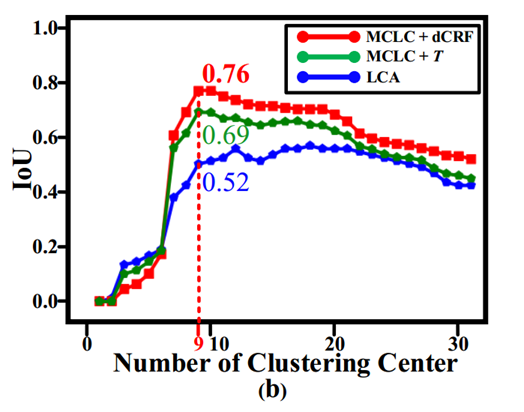

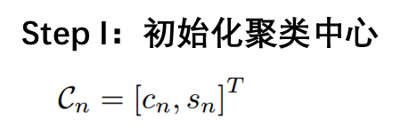

> 实验表明：聚类中心个数为9时，IoU 达到峰值

首先是将输入图像划分为n个网格区域，这每个区域的面积是相等的，然后初始化每个区域的聚类中心，而每个聚类中心包含颜色信息和图像空间位置信息，由以上公式表达。

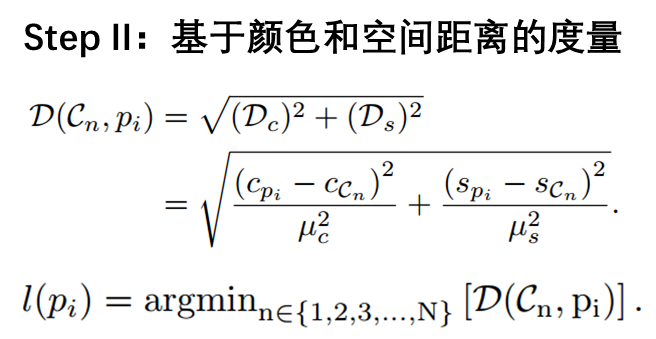

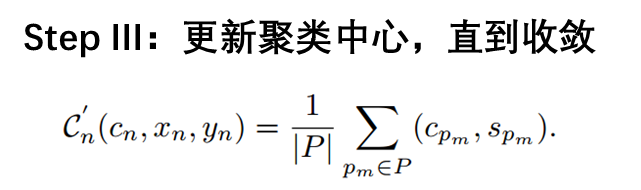

第二步是进行颜色与空间的距离测量，对于每个像素，先计算它与邻近聚类中心的综合距离，包括它的颜色距离和空间距离，归一化处理后，然后计算总距离，根据最小距离决定该像素属于哪个聚类中心。

第三步进行迭代更新直到收敛，  计算每个聚类中心的新位置，也就是颜色与位置的均值，若新旧聚类中心的距离小于阈值1，则认为收敛，那么就完成聚类，最终得到了如第四张图所示的一个粗略的分割结果

**那么这个单次LCA聚类分割有什么问题呢？**&#x663E;然得到基于单次线性聚类的粗分割图，由于固定的聚类数，颜色和空间尺度不同，边缘区域容易聚类到错误的聚类中心，导致结果不完整或过大。作者针对这个问题，提出采用蒙特卡洛正则化来抑制误聚类。

## B. 蒙特卡洛正则化

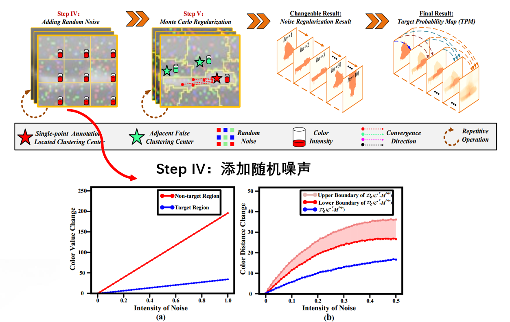

**减少边缘误分类，提高目标区域的分割精度**

论文作者的解决思路是，添加随机噪声，多次运行LCA聚类算法，然后观察哪些区域在不同扰动下始终被聚类为目标，再然后的话就是通过反复进行带噪声的实验，统计聚类结果，最终获取稳定可靠的结果，提高目标区域的分割精度，减少边缘误分类。

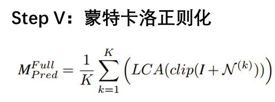

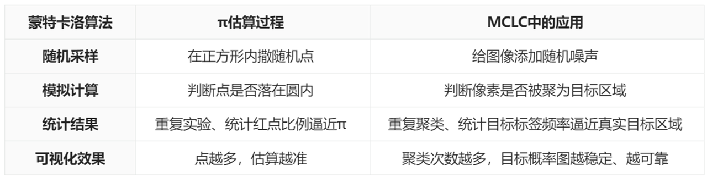

对整个MCLC的蒙特卡洛应用与Π的估算过程进行了一个归类，可以对比发现在视觉聚类中利用蒙特卡洛方法的思想还是非常清晰可观的。

# MC正则化的改进效果

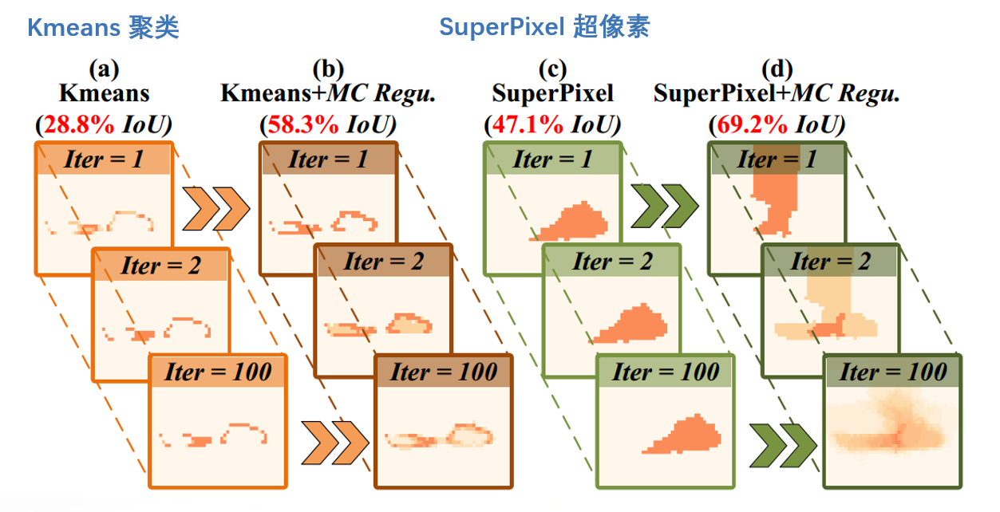

> **MC作用下：目标区域更完整，误分类更少，分割精度更高**

这里主要展示了不同方法在目标区域分割上的效果对比，包括 Kmeans 聚类、SuperPixel 超像素方法及其结合MC正则化的改进版本，图中 Kmeans聚类和超像素方法均存在局部最优和目标区域不完整的问题，MC正则化改进后，Kmeans 聚类的IoU提高了29.5%。超像素方法的 IoU 提高了 22.1%。

# 实验结果

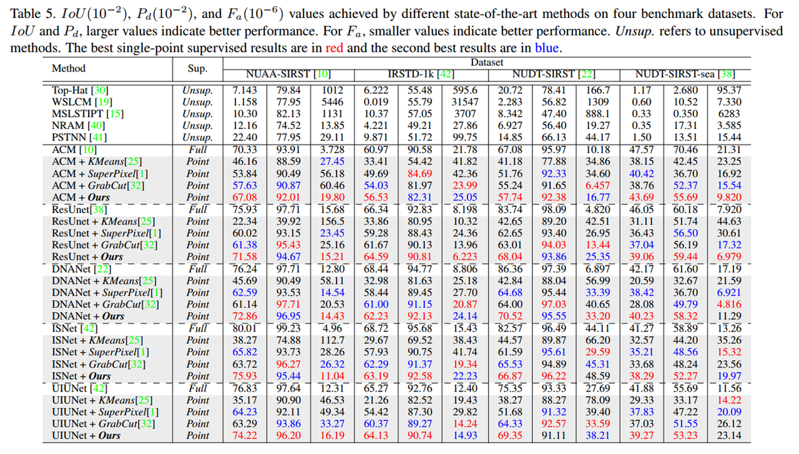

> **MCLC性能超过绝大多数的无监督，全监督，点监督方法。**

