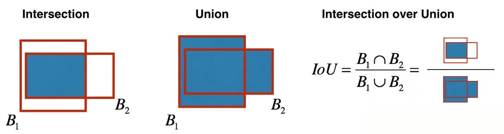
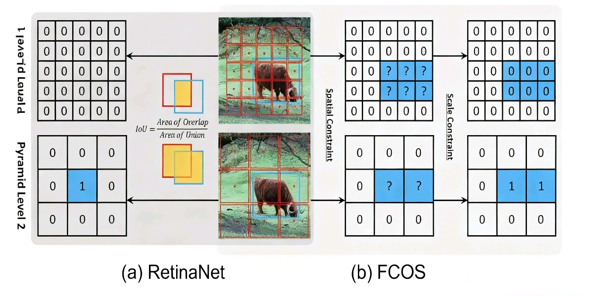

# 标签分配策略与小目标检测

# 引言

&#x20;       由于物体尺寸有限且信息不足，小目标检测正成为计算机视觉中最具挑战性的任务之一，面临着信息丢失和正样本不足两大挑战。提高小物体检测准确性的方法有很多，如特征融合、数据增强和超分辨率等。由于足够数量和高质量的正样本对于物体检测至关重要，因此标签分配策略是影响最终结果的核心因素。

# A. 小目标检测

> ***导读：本部分主要讲解小目标的特点，方便后续对标签分配策略的引入和讨论。***

&#x20;       小目标检测长期以来是目标检测中的一个难点，其旨在精准检测出图像中可视化特征极少的小目标，相对于常规尺寸的目标，小目标通常缺乏充足的外观信息，因此难以将它们与背景或相似的目标区分开来。此外，真实场景是错综复杂的，通常会存在光照剧烈变化、目标遮挡、目标稠密相连和目标尺度变化等问题，而这些因素对小目标特征的影响是更加剧烈的，进一步加大了小目标检测的难度。

**当今小目标检测面临的挑战：**

1. **可用特征少。**

2. **定位精度要求高。**

3. **现有数据集中小目标占比少。**

4. **正负样本不均衡：**&#x73B0;有的方法大多是预先在图像的每个位置生成一系列的锚框。通过设定固定的阈值来判断锚框属于正样本还是负样本。这种方式导致了模型训练过程中不同尺寸目标的正样本不均衡问题。当人工设定的锚框与小目标的真实边界框差异较大时，小目标的训练正样本将远远小于大/中尺度目标的正样本，这将导致训练的模型更加关注大/中尺度目标的检测，而忽略小目标的检测。

5. **小目标聚集问题：**&#x5C0F;目标具有更大概率产生聚集现象。当小目标聚集出现时，聚集区域相邻的小目标通过多次降采样后，反应到深层特征图上将聚合成一个点，导致检测模型无法区分。当同类小目标密集出现时，预测的边界框还可能会因后处理的非极大值抑制操作将大量正确预测的边界框过滤，从而导致漏检情况。另外，聚集区域的小目标之间边界框距离过近，还将导致边界框难以回归，模型难以收敛。

6. **网络结构问题：**&#x951A;框这一设计恰恰对小目标极不友好。此外，在现有网络的训练过程中，小目标由于训练样本占比少，对于损失函数的贡献少，从而进一步减弱了网络对于小目标的学习能力。

# B. 标签分配策略

> ***导读：针对初学者，除了需要掌握一些必要的基础概念除外，同时有几个比较典型的疑问需要以通俗的概念去辅助理解。本部分主要讨论早期静态标签分配的两大基础模型 RetinaNet 和 FCOS 。***

**关键词：**&#x6807;签分配，正负样本，锚框( anchor )，真实目标( GT )，阈值( IOU )

## 导论

> 请先学习 openmmlab 目标检测公开课或可参考课堂笔记
>
> [ 目标检测的基本思路](https://xcn4rqyces3k.feishu.cn/docx/DaQPduGEHoTAjUxFd1DcheiQnkS)
>
> [ 两阶段目标检测算法](https://xcn4rqyces3k.feishu.cn/docx/PLy9dl7RdokLtFxBBeLcQb7cntG)
>
> [ 单阶段目标检测算法](https://xcn4rqyces3k.feishu.cn/docx/Sn0LdypfBoDC96xuEU0cn2AOnMc)
>
> [ 无锚框目标检测算法（Anchor-free Methods）](https://xcn4rqyces3k.feishu.cn/docx/WO0ud57u4o4blvxyE9vcPs9JnEc)

***

**Q1：标签分配的初衷是什么？**

* **明确“学习目标”：**&#x6A21;型会输出大量预测框，但这些框里大部分是背景（负样本），只有少数是真正的目标（正样本）。标签分配就是明确告诉模型，哪些预测框需要去学习“预测这个真实目标的位置和类别”。

* **解决模糊性：** 一个真实目标可能被多个候选框覆盖（重叠度高），一个候选框也可能覆盖多个真实目标（重叠区域）。标签分配需要解决这种模糊性，明确责任归属。

* **处理正负样本不平衡：** 背景（负样本）通常远多于前景（正样本）。标签分配策略需要有效地筛选出有代表性的正负样本，避免模型被海量简单负样本淹没。

* **影响训练稳定性与效率：** 好的分配策略能提供高质量、平衡的正负样本，加速模型收敛并提升最终精度。差的策略可能导致训练不稳定、收敛慢或性能低下。

***

**Q2：让正样本越多越好吗？**

* **引入噪声：**&#x5F88;多预测框其实和真实目标匹配度不高，强行作为正样本，会让模型学错“什么是真正的目标”。

> **就像把错误的知识点当重点学，越学越偏**

* **训练低效：**&#x6A21;型要给大量不相关的预测框计算损失，浪费计算资源，就像做了很多无用功，效率很低。

> **正样本就像“重点知识点”，如果给学生的重点太多，学生反而抓不住核心；但如果太少，又学不到足够的内容。**

***

在了解标签分配之前，可以对锚框，阈值和正负样本的定义去了解。

**锚框的定义如下：**

&#x20;      在目标检测中，锚框是预定义的一组边界框，用于覆盖图像中可能出现的不同形状和大小的物体。（如图所示的红绿青蓝紫五种不同的框）

***

**&#x20;IOU 的定义如下：**

**&#x20;      IOU**是 Intersection over Union 的缩写，中文称为**交并比**。它计算的是“预测的边框”和“真实的边框”的交叠率，即它们的交集和并集的比值。这个比值用于衡量预测边框与真实边框的重叠程度，从而评估目标检测的准确性。在目标检测任务中，通常使用 bounding box 与 ground truth 之间的 IOU 值大小来判断预测结果的好坏。

***

**正负样本的定义如下：**

假设定义以 IOU = 0.6 为基准，基于 IOU 阈值的分配（如图所示）：

**正样本：** 与任何一个真实目标框的 IOU 大于某个高阈值（如 0.6）的候选框。

**负样本：&#xA0;**&#x4E0E;所有真实目标框的 IOU 都小于某个低阈值（如 0.3）的候选框。

**忽略样本：** IOU 介于高低阈值之间（如 0.3-0.6）的候选框，不参与损失计算。

***

**非极大值抑制（ NMS ）**

&#x20;     检测算法有时会针对单个物体给出多个相近的检测框。在所有重叠框中，只需要保留置信度（ IOU ）最高的。

## 目标检测中的标签分配

**标签分配可以从多种角度分类（本文主要探讨基础静态标签分配）**

接下来我会分别从（ anchor-based 与 anchor-free ）列举。

由于 CNN 的平移等变性，通常学习相对坐标，既然是相对坐标，就需要一个“零点”。

dense prediction 的输出结果数远多于目标数，故而需要研究目标和输出结果的匹配问题，即“哪个（些）输出对应哪个目标”。

***

**当“零点”是一个框的时候，就是 Anchor-based 方法，“零点”即 Anchor box，以 RetinaNet 为例（与 Faster RCNN 基本一致）：**

**RetinaNet 根据 anchor 和目标的 IOU 确定正负样本**

**正负难易样本的经验比例**

负样本 ：正样本 ≈ 1000 ：1

简单样本 ：困难样本 ≈ 1000 ：1

**&#x20;RetinaNet 标签分配具体做法**

&#x20;       对于单张图片，首先计算这张图片的所有 Anchor 与这张图标注的所有目标的 IOU 。对每个 Anchor ，先取 IOU 最大的目标回归标签作为其回归标签。然后，根据最大 IOU 的值进行分类标签的分配。对于 IOU 小于 0.4 的 Anchor ，其标签置为 0 ，代表负样本 Anchor ；对于最大 IOU 大于 0.5 的 Anchor ，其标签置为最大 IOU 对应的目标类标签 +1（因为处理数据集时都是从0开始的，所以这里要 + 1 ），代表正样本 Anchor 。剩下的 Anchor 样本即 IOU 在 0.4-0.5 之间的 Anchor ，其类标签置为 -1 ，代表被忽略的 Anchor ，这部分 Anchor 在 focal loss 中不参与 loss 计算。

> **举个例子**
>
> 
>
> 假设这张照片里有一个需要检测的目标（比如图中的那个核心区域），同时图片中生成了很多 Anchor（可以理解为不同位置、大小的候选框）。
>
> 1. 计算 IOU ：首先计算每一个 Anchor 和这张图中被标注的目标（比如那个核心区域）的交并比（ IOU ）。
>
> 2. 分配回归标签：对每个 Anchor ，选取 IOU 最大的那个目标的回归标签作为它的回归标签。
>
> 3. 分配分类标签：
>
> * 对于 IOU 小于 0.4 的 Anchor ，分类标签置为 0 ，属于负样本（ Negatives ），就像图中左侧蓝色网格里的那些区域，模型会学习将这些区域判定为“没有目标”。
>
> * 对于 IOU 大于 0.5 的 Anchor ，分类标签置为最大 IOU 对应目标类标签+1，属于正样本（ Positives ），如图中右侧棕色网格里的区域，模型会学习将这些区域判定为“有目标且属于对应类别”。
>
> * 对于 IOU 在 0.4-0.5 之间的 Anchor ，分类标签置为 -1 ，属于被忽略的样本（ Ignore ），就像图中中间过渡的那些区域，在 focal loss 计算时不会参与损失计算，模型不对其做明确的正负样本判定。

**Anchor 标签分配的代码如下：**

***

**当“零点”是一个点的时候，就是 anchor-free 方法，“零点”即 anchor point，以 FCOS 为例：**

**FCOS 根据目标中心区域和目标的尺度确定正负样本**

> &#x20;FPN 与中心度（ Center-ness ）等请参考[ 无锚框目标检测算法（Anchor-free Methods）](https://xcn4rqyces3k.feishu.cn/docx/WO0ud57u4o4blvxyE9vcPs9JnEc)

**FCOS 标签分配具体做法：**

1. **将各层特征点位置映射回输入图像中**

&#x20;      特征图是输入图像下采样得到的，比如下采样8倍的特征图上的一个点，得先映射回原图的位置。公式里的 \frac{s\_i}{2} 是为了让这个点对齐到原图对应区域的中心（比如下采样8倍的点(0,0)，映射回原图是(4,4)，处于8×8区域的中心）。这一步是为了后续能和原图的真实目标框计算距离。

* **位于物体框内的位置点作为正样本候选**

&#x20;       对每个映射回原图的特征点，计算它到每个真实目标框（gt box）四条边的距离：左(l)、上(t)、右(r)、下(b)。只有当这四个距离的最小值大于0时，说明这个点在目标框内部，才有资格当正样本候选。

* **某位置点到物体边框的距离只有位于一定范围内才可作为正样本**

&#x20;        不同层的特征图负责不同大小的目标，作者给每一层定了一个距离上下限（比如\[0,64]、\[64,128]等）。这里的距离是指该点到目标框四条边的最大值（max(l,t,r,b)）。只有这个最大值落在对应层的区间里，这个点才是该层负责的正样本。

* **选择物体框面积最小的作为目标(标签)**

&#x20;      经过前两步，有些点可能同时属于多个目标框的候选。这时候就选面积最小的那个目标框作为它的“专属对象”。具体操作是：先给每个目标框算好面积，然后用前两步的筛选条件做掩码，把不符合的面积设为极大值，最后对每个点找面积最小的那个目标框的索引，这样就确定了它要负责预测的目标。

> **举个例子**
>
> 
>
>
>
>
>
>
>
> **先把特征点映射回原图，再筛选出目标框内的点作为正样本候选，接着根据点到目标框的最大距离确定所属层的正样本，最后对同时属于多个目标框的点，选面积最小的目标框作为标签。**&#x6BD4;如示例中，若特征点同时属于运动员和网球拍框，因网球拍框面积小，就给它分配网球拍的标签。
>
>

**FCOS 标签分配的代码如下：**

## **归纳**

**RetinaNet：**

&#x20;RetinaNet 通过交并比（IoU）在空间维度和尺度维度同时筛选正样本

* 首先，对图像构建不同金字塔层级（Pyramid level 1、Pyramid level 2）的特征图，每个层级对应不同大小的Anchor框。

* 计算 Anchor 框与真实目标框（蓝色框）的 IOU ：当 IOU 大于设定阈值（如0.5）时，该 Anchor 框所在位置被标记为正样本（1）；IOU小于阈值（如0.4）时标记为负样本（0）。

**FCOS：**

FCOS 分两步筛选正样本：先在空间维度找候选正样本，再在尺度维度确定最终正样本

* **空间维度（Spatial Constraint）：**&#x5148;判断特征点是否落在真实目标框（蓝色框）内部，若在内部则标记为候选正样本。

* **尺度维度（Scale Constraint）：**&#x4E0D;同金字塔层级负责不同大小的目标，只有候选正样本的尺度（对应目标大小的范围）与所在层级的尺度区间匹配时，才被标记为最终正样本（1）；否则为负样本（0）。

***

**缺点：**

* **超参数敏感：** IOU 阈值的选择对性能影响很大，需要精心调参。

* **上下文信息缺失：** 仅依赖几何信息，没有考虑分类置信度、定位精度等模型预测本身的信息。

* **模糊性处理粗糙：** 对于重叠目标或边界框模糊的情况，分配可能不合理。

* **灵活性差：** 固定的规则无法适应不同目标大小、形状、场景复杂度的变化。

> **总结：在目标检测任务中，无论是anchor-based、anchor-free，亦或one-stage、two-stage也好，各类目标检测算法最重要的区别之一就在于标签分配，其目的是将样本划分成正样本和负样本，然后与GT之间计算loss，决定模型如何学习和收敛。**

# C. 小目标检测的标签分配策略

> ***导读：对于初学者而言，刚接触小目标检测任务的时候，会直接使用MMDetetion下的模型直接去训练，会发现相比检测性能不好更甚的是机器压根就学习不到，在学习标签分配之后，这种急功近利尝试的做法确实显得十分愚钝。本部分主要针对小目标检测中的标签分配策略进行解答和调研。暂时不对所有方法细讲。***

## 导论

&#x20;      尽管已经有很多关于目标检测中标签分配策略的研究，但大多数策略都是针对传统数据集设计的，很少有专门为小目标设计的策略。当这些传统的标签分配策略直接被用于小目标检测时，它们的准确性会显著下降。

***

**Q1：（以 FCOS 为例）使用FCOS来检测小目标基本为零的原因是什么？**

我总结为以下几点：

1. **正样本严重不足**

* FCOS 是在特征图上的点直接回归边界框，而小目标在特征图上的覆盖范围很小，很多目标甚至只覆盖 1\~2 个特征点。

* 如果这些点不在目标框的“中心区域”或被尺度区间过滤掉，就会被判定为负样本，导致小目标完全没有正样本参与训练。

- **尺度区间匹配不合理**

* FCOS 不同特征层负责不同尺度的目标（例如 P3 负责 32\~64 像素大小的目标）。

* 小目标如果尺寸低于某一层的下限，就会被直接排除，无法被任何特征层选中，结果是训练时完全没有机会学习小目标的特征。

- **回归难度高**

* 小目标在原图上像素少，特征信息量低，回归四条边距离时误差相对更大。

* 一旦边界框回归稍有偏差，就会导致交并比（IOU）骤降，检测框被 NMS 过滤掉。

- **中心度惩罚**

* &#x20;FCOS 用中心度（centerness）来抑制边界附近样本的权重，但小目标的中心点范围很小，很多正样本点的中心度得分偏低，进一步削弱了它们对损失的贡献。

- **标签分配次优**

* 当一个点同时属于多个目标框时，FCOS 会选面积最小的框作为回归对象。

* 小目标面积最小，容易被分配到一些特征质量差的点（如靠近背景的位置），从而影响学习效果。

***

**Q2：（调研）到目前为止，专门为小目标设计的标签分配策略和度量标准主要包括？**

1. **标签分配策略**

* **S³FD ：**&#x901A;过逐步降低 IOU 阈值（从 0.5 降至 0.35 ，再到 0.1 ），为小目标争取更多正样本，解决小目标因 IOU 敏感性导致正样本不足的问题。

* **RKA（基于排名的分配）：**&#x4E0D;依赖固定 IOU 阈值，直接选择与真实框关联的前 k 个锚框作为正样本，增加小目标的正样本数量。

* **RFLA（基于高斯感受野的标签分配）：**&#x5C06;特征点的有效感受野和真实目标框都建模为高斯分布，通过计算两者的距离（如 Kullback-Leibler 散度）来分配标签，从感受野角度优化小目标的样本分配。

* **HLA（分层标签分配）：**&#x57FA;于 RFLA 进一步设计，通过多阶段的分数排序和半径调整，实现小目标的平衡学习，提升检测的整体召回率。

- **度量标准**

* **DotD（点距离）：**&#x4EE5;边界框的中心点距离代替 IOU ，降低对小目标边界框大小的敏感性，使小目标能获得更多正样本。

* **NWD（归一化Wasserstein距离）：**&#x5C06;边界框建模为二维高斯分布，通过计算两个高斯分布的 Wasserstein 距离来度量相似性，可在无重叠时仍能有效衡量小目标间的相似性，且对尺度不敏感。

* **RFD（感受野距离）：**&#x57FA;于 RFLA 提出，用于测量高斯感受野和真实目标框之间的相似性，替代传统的 IOU 或中心采样策略。

* **SimD（相似度距离）：**&#x7ED3;合位置相似度和形状相似度，能自适应不同数据集和不同大小的物体，可替代 IOU 用于标签分配和非极大值抑制（NMS），在小目标检测中表现出优越性能。

